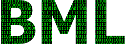

  [](http://commitizen.github.io/cz-cli/)

# BML

> Binary markup language

BML a powerful declarative and symmetrical parser and packer for binary data.

Instead of writing imperative code to parse a piece of data, you declaratively define a data structure that describes your data. And you can use it in one direction to parse data into Javascript objects, and in the other direction, to pack objects into binary data.

## Installing / Getting started

NodeJS: Just use npm to install BML and you are set :)

```shell
npm install binary-markup --save
```

```shell
yarn add binary-markup
```

## Example

First describe structure of binary data

```javascript
const { byte, struct } = require('binary-markup');

// define composite type
const rgb = struct(byte`r`, byte`g`, byte`b`);
// you can use previously defined type to describe more complex ones
const colorsType = struct(rgb`main`, rgb`secondary`);
```

Now you can read and parse binary data

```javascript
const fs = require('fs');
const { parse } = require('binary-markup');

fs.readFile('file.bin', function(err, data) {
  console.log(parse(colorsType, data));
});
```

You can as well convert javascript object to binary data

```javascript
const { pack } = require('binary-markup');

console.log(
  pack(colorsType, {
    main: {
      r: 211,
      g: 33,
      b: 22,
    },
    secondary: {
      r: 255,
      g: 255,
      b: 255,
    },
  })
);
```

## Features

TBD

## Contributing

If you'd like to contribute, please fork the repository and use a feature
branch. Pull requests are warmly welcome.

## Links

- Project homepage: https://github.com/srg-kostyrko/BML
- Repository: https://github.com/srg-kostyrko/BML
- Issue tracker: https://github.com/srg-kostyrko/BML/issues
  - In case of sensitive bugs like security vulnerabilities, please contact
    srg.kostyrko@gmail.com directly instead of using issue tracker. We value your effort
    to improve the security and privacy of this project!
- Related projects:
  - jBinary: https://github.com/jDataView/jBinary - uses similiar concept of descrative type definitions, but no activity recently
  - Construct: https://github.com/construct/construct - Python library, lots of ideas taken from it

## Licensing

The code in this project is licensed under MIT license.
